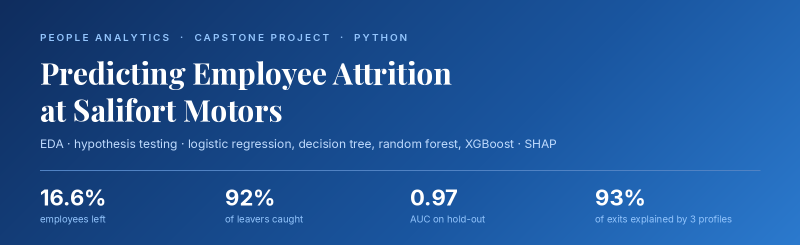
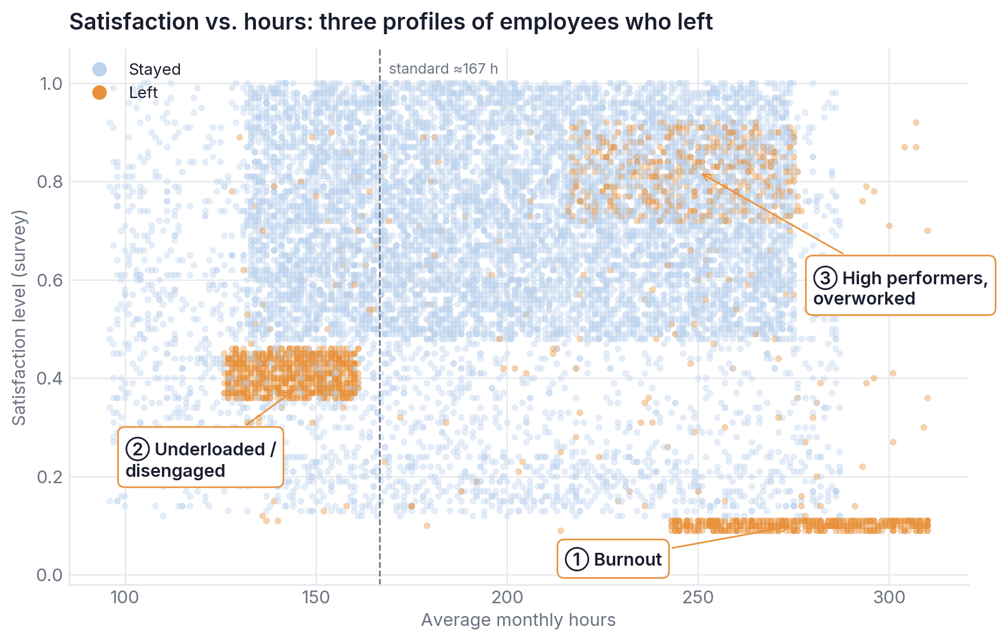
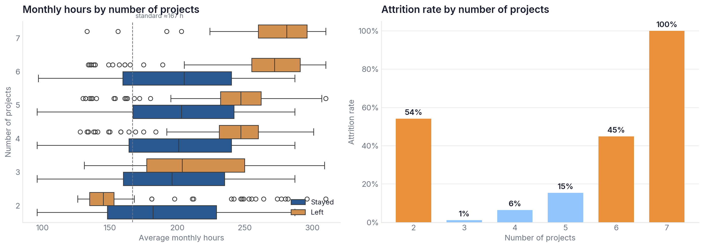
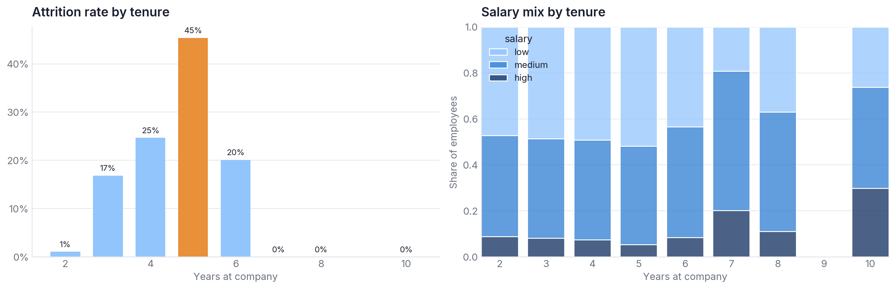
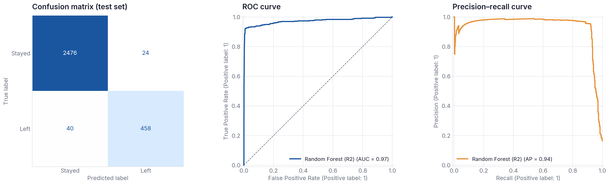
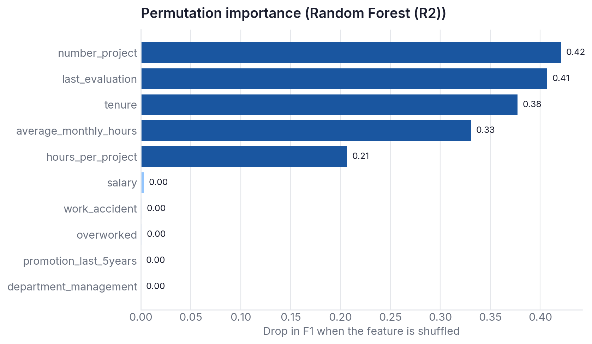
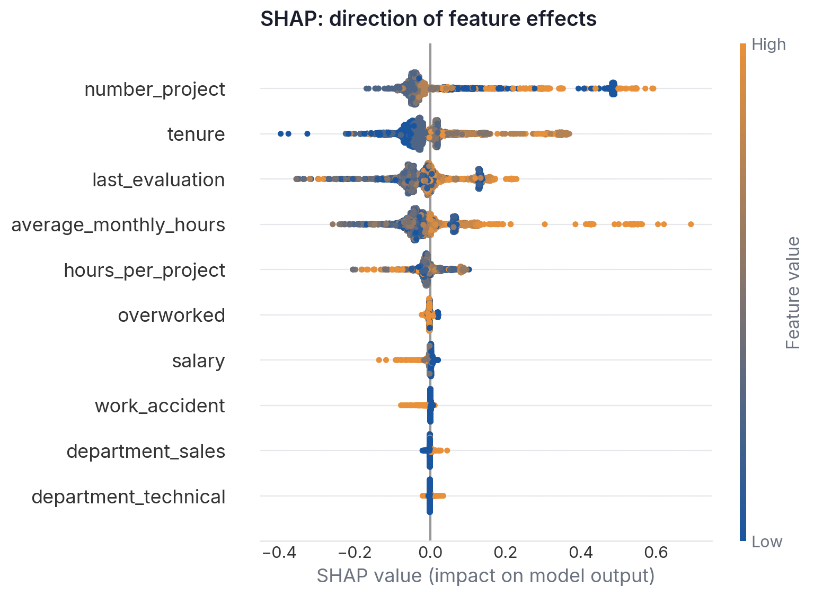

<p align="center"></p>

<p align="center">
  
  
  
  
  
</p>

<p align="center">
  <a href="notebooks/Salifort_Motors_Employee_Attrition.ipynb"><b>Notebook</b></a> ·
  <a href="reports/Executive_Summary.pdf"><b>Executive Summary</b></a> ·
  <a href="reports/PACE_Strategy_Document.pdf"><b>PACE Strategy Document</b></a>
</p>

---

## Business problem

Salifort Motors is losing employees at a high rate — **16.6%** of the workforce in the dataset left. Every departure brings hiring, onboarding, and training costs, plus lost experience. Leadership asked two questions:

1. **Why** are employees leaving?
2. **Who** is likely to leave next, so HR can step in early?

> **Target:** `left` (1 = the employee left, whether they quit or were let go) · **Data:** HR survey, 14,999 rows → 11,991 after removing 3,008 duplicates · **Framework:** PACE (Plan → Analyze → Construct → Execute)

---

## Key results

| | |
|---|---|
| **Recommended model** | Random forest trained **without survey data** — runs monthly on HRIS data |
| **Hold-out performance** | Precision **0.95** · Recall **0.92** · F1 **0.935** · AUC **0.97** · Accuracy **0.98** |
| **What it means** | Catches 92% of employees who are about to leave; 95% of its flags are correct |
| **At-risk employees today** | ~180 (1.8%) — mostly overworked high performers |

### Three profiles explain 93% of departures

<p align="center"></p>

| Profile | Share of leavers | Projects | Hours / month | Satisfaction |
|---|---:|---:|---:|---:|
| ② Underloaded / disengaged | 42% | 2 | ~145 | 0.41 |
| ① Burnout | 26% | 6–7 | ~275 | 0.10 |
| ③ High performers, overworked | 25% | 4–5 | ~250 | 0.82 |

### Workload is the #1 driver — and it's U-shaped

<p align="center"></p>

The sweet spot is 3–4 projects (1–6% attrition). At 7 projects, **every** employee left. The median employee works ~200 hours a month versus a ~167-hour standard.

### Tenure: the critical window is years 4–5

<p align="center"></p>

Attrition peaks at 45% in year 5, and nobody leaves after year 6. Only **1.7%** of employees were promoted in the last five years.

---

## Model comparison

Mean scores from 5-fold stratified cross-validation (training set):

| Model | Features | Precision | Recall | F1 | AUC |
|---|---|---:|---:|---:|---:|
| Random forest | All (incl. survey) | 0.988 | 0.915 | **0.950** | 0.980 |
| XGBoost | All (incl. survey) | 0.975 | 0.920 | 0.947 | 0.984 |
| Decision tree | All (incl. survey) | 0.969 | 0.918 | 0.942 | 0.960 |
| **Random forest** ✅ | **No survey data** | 0.934 | 0.912 | **0.922** | 0.975 |
| XGBoost | No survey data | 0.932 | 0.904 | 0.918 | 0.980 |
| Decision tree | No survey data | 0.908 | 0.904 | 0.905 | 0.956 |
| Logistic regression | All (incl. survey) | 0.462 | 0.252 | 0.326 | 0.885 |

**Why the no-survey model wins in practice:** it gives up only ~3 points of F1 but doesn't depend on periodic surveys, and it removes a leakage risk — satisfaction may have been recorded after an employee had already decided to leave. Logistic regression fails because the key relationships are non-linear: it cannot model attrition at both 2 and 7 projects at the same time.

<p align="center"></p>

### What drives the predictions

<p align="center">
  
  
</p>

---

## What makes this analysis different

- **Leakage-aware modeling:** a second round without `satisfaction_level`, so the model works on HRIS data alone.
- **Business-tuned threshold:** chosen on out-of-fold predictions (not the test set). F1 stays at 0.89–0.92 across thresholds; 0.4 is recommended for the pilot.
- **Statistics with effect sizes:** chi-square and Mann–Whitney tests. Department is statistically significant (p = 0.013) but negligible (Cramér's V = 0.04) — so it's not a lever.
- **Explainability for HR:** SHAP plus a depth-3 surrogate tree (F1 0.887) that turns the model into plain-language rules.
- **Actionable output:** out-of-fold risk scores for current employees, with risk bands by department.
- **Ethical guardrails:** risk scores trigger support conversations, never penalties.

---

## Recommendations

1. **Cap workload** at 4–5 projects per person; flag anyone above 200 hours/month.
2. **Pay for overtime or grant comp time**, or bring hours back to standard.
3. **Invest in years 3–5:** promotion and pay reviews for high performers with 4+ years of tenure.
4. **Reward results, not hours:** a top rating should not require 250+ hours a month.
5. **Pilot monthly risk scoring** in 1–2 departments against a control group, and measure the change in attrition over 2–3 quarters.

**Limitations:** voluntary and involuntary departures are not separated; the data is a single snapshot; the model shows associations, not causes.

---

## Repository structure

```
salifort-employee-attrition/
├── notebooks/
│   └── Salifort_Motors_Employee_Attrition.ipynb   # full analysis, PACE stages
├── reports/
│   ├── Executive_Summary.pdf                      # one-page summary for leadership
│   ├── PACE_Strategy_Document.pdf                 # project decisions and reflections
│   ├── cv_results.csv                             # cross-validation scores
│   └── test_results.csv                           # hold-out scores
├── images/                                        # charts used in this README
├── data/
│   └── README.md                                  # where to get the dataset
├── sergei_analytics.mplstyle                      # chart style
├── requirements.txt
└── LICENSE
```

## How to run

```bash
git clone https://github.com/SergeiTolstoi/salifort-employee-attrition.git
cd salifort-employee-attrition
pip install -r requirements.txt
# download the dataset (see data/README.md) into data/HR_capstone_dataset.csv
jupyter notebook notebooks/Salifort_Motors_Employee_Attrition.ipynb
```

Full execution takes ~10–15 minutes on a single CPU (grid search).

**Tech stack:** Python · pandas · NumPy · scikit-learn · XGBoost · SHAP · SciPy · matplotlib · seaborn · Jupyter

---

<p align="center"><sub>Built by <b>Sergei</b> as the capstone for the Google Advanced Data Analytics Professional Certificate.<br>Salifort Motors is a fictional company; the dataset is used for educational purposes.</sub></p>
